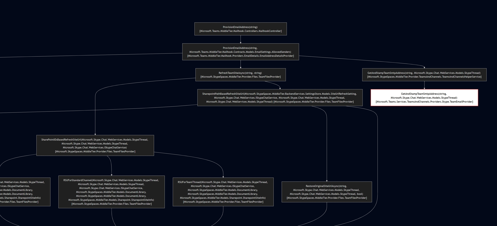

# Roslyn Call Graph Analyzer

This tool analyzes a .NET solution using Roslyn and extracts method call graphs, allowing tracing of paths from an entry method to a target method.

> **AI-generated & human-assisted**

## Features

* Builds call graph from Roslyn syntax and semantic model
* Resolves method implementations (including interface implementations)
* Outputs full call graph in JSON format
* Supports path tracing to a specific method
* Exports paths in simplified text and Mermaid diagram formats

## Usage

### 1. Analyze solution and export call graph

```
RoslynCallGraphAnalyzer.exe analyze <solutionPath> <entryMethod> <outputFolder>
```

Example:

```
RoslynCallGraphAnalyzer.exe analyze "C:\src\Teamspace-MiddleTier\Source\MiddleTier.sln" "Microsoft.Teams.MiddleTier.Mailhook.Controllers.MailhookController.ProvisionEmailAddress(string)" "C:\temp\callgraph"
```

This produces:

* `mtcallgraph.json` — full call graph starting from `entryMethod`

### ⚠️ Performance Note

> Analyzing large solutions may take several minutes or longer depending on size and complexity. Roslyn processes all syntax trees and semantic models to build the call graph.

### 2. Find all paths to a target method

```
RoslynCallGraphAnalyzer.exe paths <inputFolder> <targetMethod>
```

Example:

```
.\RoslynCallGraphAnalyzer.exe paths "C:\temp\callgraph" "SetThreadPropertyOnBehalfOfUser"
```

This produces:

* `callgraphpaths.json` — all simplified call paths
* `callgraphpaths.mmd` — call paths in Mermaid syntax
* `callgraphleafs.json` — leaf methods

### Visualizing

To view the call graph paths:

1. Copy contents of `callgraphpaths.mmd`
2. Go to [https://mermaid.live](https://mermaid.live)
3. Paste and render the graph

> 📷 You can see an example of a rendered Mermaid diagram below:
>
> 
>
> Or view it directly on [Mermaid Live Editor](https://mermaid.live/view#pako:eNrtG9tu4jj0V1DmpSvRiFy4PuyKodNZpEFbTVqttMM8uMSARYgj23TKVvPv61twAm2hIWF2duEB7Ng-N5-bT8yTNcEhtHrWjIBkXru9Gsd958vYuiH4AVGE4w9LgKJ-GBJI6QVlBMWzX2pfRmhCMMVTZt9CsKT2CIVhBG8RJPaIz59jvLAHOGYERxEkdPPQPPs6tr5yXO4eXPXawajAhPFRzk1EbQkpgIxxENTuRxH-BsMAxiEn5kDyJVVivgJ2BRn_1h1No36WztQseZylj5AN5iCOYXSNIz7Up-t4smHpGTEGi3UCgwRMYI6aFLR9jSI-IqiVrS2UPkc5mMPJoh-H1-hRTOMtTUHAAIMXW6hsPsjsP-F9AMkDEliH8rl4rB9lRf_CGi1tOXo7JxCEhRaVKIlmRhLD-AFEKOTcX-HJaglj9gndE0AQpNeYBAmcIBBpIZ1KPiWy2lJ6ludtPcAEZrWtRIRthTCYAwITjGIWIAaH8RQXQXXHUIQY3wrbwPsdRskGW0dhE8QIPEKLV7QIJmnixhzozgPBaw519xXU9do9xtFvhYzY8CxJMIxvCdppPEtAIXM8AbWOopZLlBO6TATFA46ccY8utOOa4KVcfCMWX-wlYICXSxwLnz5FsxWRcOxhrjsCMZhBUtBDZTfS9KqUkIhyUiRQ61xqtFSFh0qFsgvsPZgseCzMuDZj0gf7tv3-8BXJDbds8DOccQ7AJmQHjLuxdPYBgLV4Pkw4XfwrBVNcJKPgo0iI7OGIysbhPGpS7igkI4KMigz1k48whnzDMHk1tdlxWibFGV5BmHxC8cLIJ6_Du79K07PfR2m7Jio18pzvdLw9ui4C1Fnfz_p-Wn2vWuv9Z_NOwdVWfsbHVRz6CTNOR2TXXNcUYD7IBcDWMttU0ijE0-ubWSb5rX1hePfMWSCt2EuuXrylGBXntE77nIOcffIBPhku7yGhc5QEDxNbE5_bHjPjcNaecafDF3LmCsLEjzBnFXKqCDWdsyGfDfn_acgv_RaujJR0_H_VXrvZEvcNQQ_GcvOltH91jfalssmbjSFnlRtEuWKsziy5ZCspx7iivPYZUkFAtmglS5mVuCptxreYS0K_NHjbIaaE3Phg6YhynpTJVkS7xiSvvSVm-9Vw4ha1vP9elDuZXygvOFZ8ZHdNoWpLNc4KsS8JLrpYpQGbRc8kASYkyJcf8sVHaaHnBVWrQrl8VSnZeB9OsHwP26cfCMHlFEqOlWsVfIsK0TDmE0GUt6qsJGShjJ4u3alGEasQn6hQ3WAq9IZDohxXf8og2XVQ6fIf56j25-JFhZy38qpE3ZZJ4JRAOk_fs1Z8S8MVJ3fzJnR4Rd8DCkNNhCDgjkQXpwvcb9_1MoUhjkWfg7sCNzHK4eWIyk7lC42J2ru3LUrcBK9hNoGBOAQkrHYXzltX2tY5m60TUw59p3TegNI2wE29uTp7AjY_wJ0XrY8oaClsNaWUnfsZLvV5ninY_EHQDIlTjpJIPmSfzmm9OSvZw6Gfv0MlM5IlS16-DFvNPux9r6hyKI0uJb55GuL35ZPmxq6CLybI67p5YVO2jmCt7zi1KYqi3rup_NQ5lXgBe-9Cz9Pty28oZPOemzzWJzjCpPeuIT8GhHc8iObxILpHg3Abx4M4XpyufzyI48Xpto4G4R1BRd-pXV7-yskQObJqesLGVNMXl71VsyluO6tmS9wGVs22uKermh1xiVY1u-JSq2o6EkdDdxx5f1N3XHlVUXc8g8nx5Q0XgyttO01DWcs0HTlHE-S05eUD3enIF5gZFJtOV74q0bw3ZJVed5zsSK4jZaQJdj1Z09MdPzvSzHZa8pidnabbbXko1J2OPK7pTlceVzIspyNeQ-bQz404MkXLjmjQnitzh8zOpm3Z8bKSdbPr9SxfRgvd4QNW3ZoRFFo9Rlawbi0h4R6Pd62ncVyrjS02h0s4tnq8ydP7xdgax9_5mgTEf2G8TJcRvJrNrd4URJT3Vom8NI_AjAAzRf57YoBXMbN6ju9IGFbvyXq0epdu2_Hshut13a7jen6nWbfWfJbn2h2_63WcbqPdcdtu83vd-luide2Gz2f7bf7dbPmO79UtGCIe4Ufq_yjybynf_wFTpnZ4)

---

Generated with ❤️ by AI and refined by human input.
